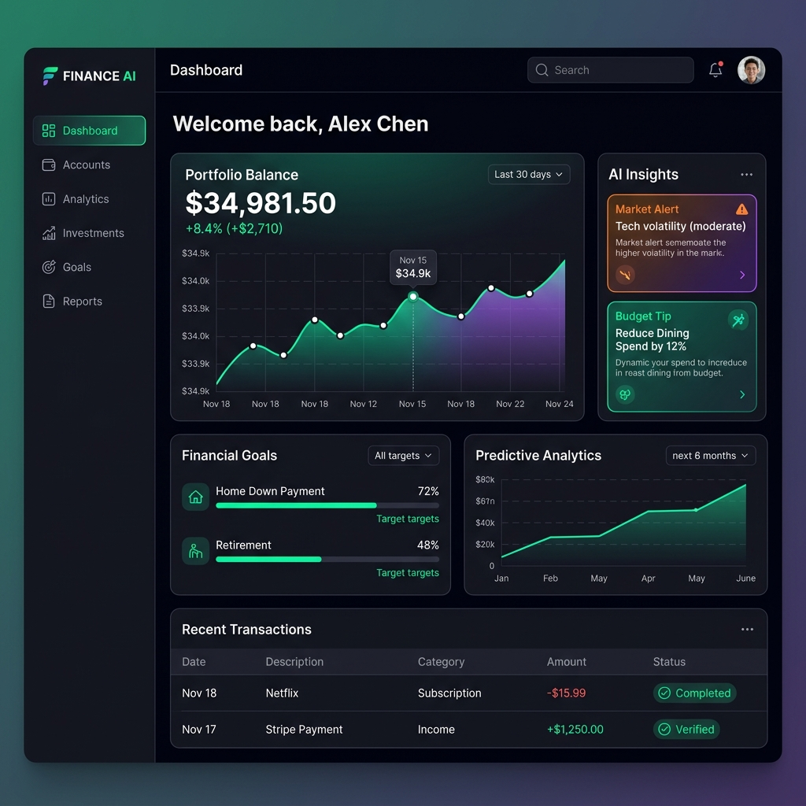

<div align="center">

<h1>🌍 Finflowy - Finance Tracker</h1>
  <p><em>“Your streamlined financial tracking application.”</em></p>
  
  <p>
    <a href="#quick-start-docker"><strong>Quick Start</strong></a> ·
    <a href="#manual-setup"><strong>Manual Setup</strong></a>
  </p>

  
  <h1>✨ Finflowy ✨</h1>
  <p>A simple, streamlined Personal Finance Dashboard designed to track expenses effortlessly.</p>

  <!-- Badges -->
  <p>
    
    
    
  </p>

</div>

---

## 🌟 Overview

Welcome to **Finflowy**.
This project provides a clean frontend and reliable node.js backend for tracking basic income and expenses.

---

## 🛠️ Technology Stack

### Frontend Ecosystem (`Frontend/`)
* React (TypeScript)
* Tailwind CSS

### Backend (`Backend/`)
* Node.js + Express
* MongoDB (Mongoose)
* JWT Authentication

---

## 🚦 Getting Started (Docker Compose)

```bash
git clone https://github.com/shreyas-bhandari/Finflowy.git
cd Finflowy-main
docker-compose up -d --build
```

> Stop containers using: `docker-compose down`
